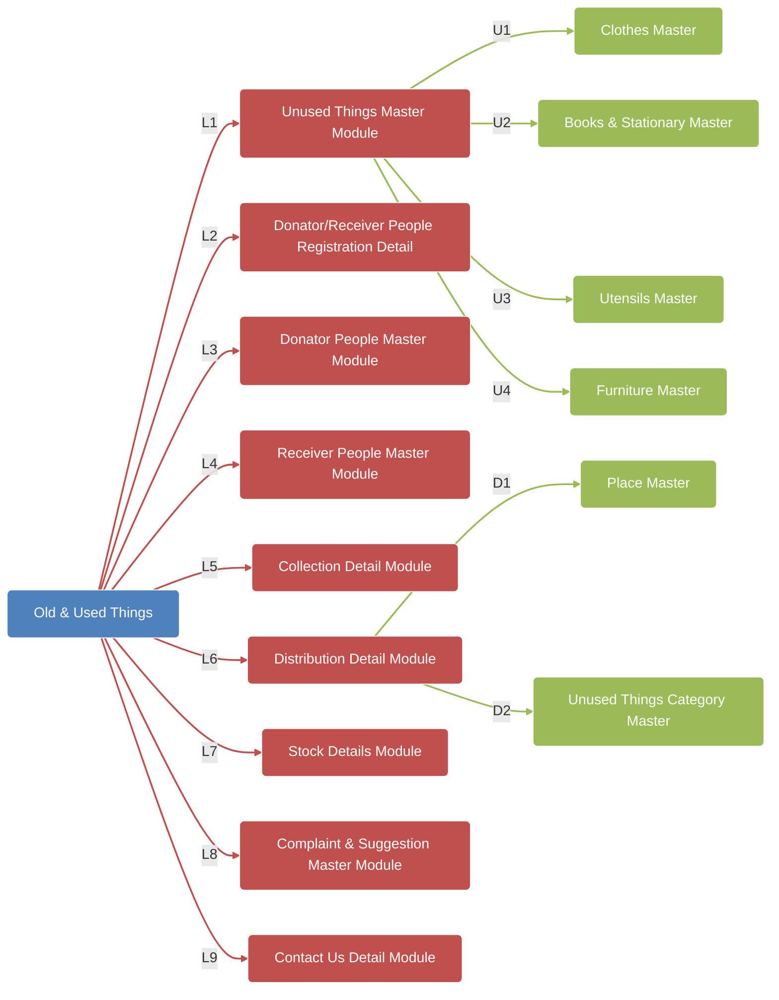
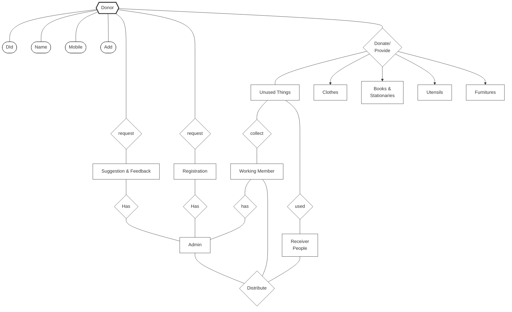
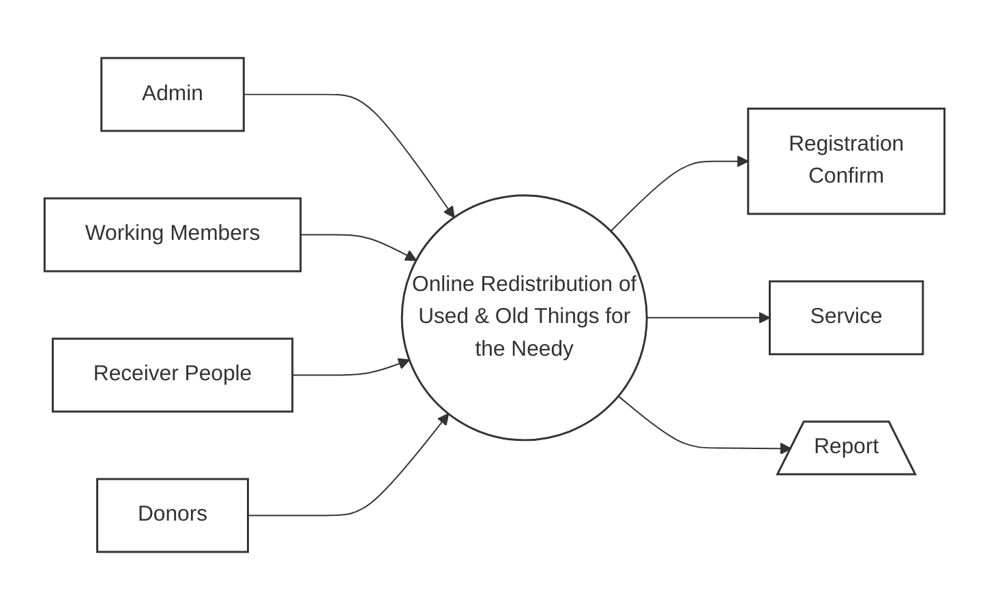
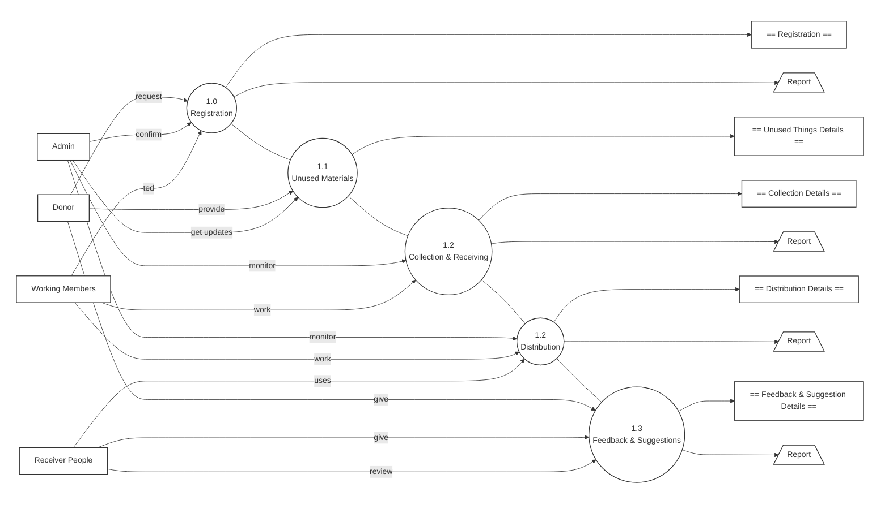
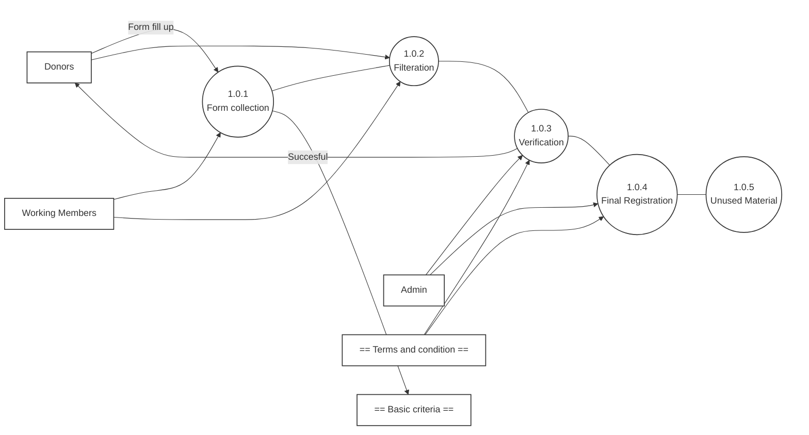
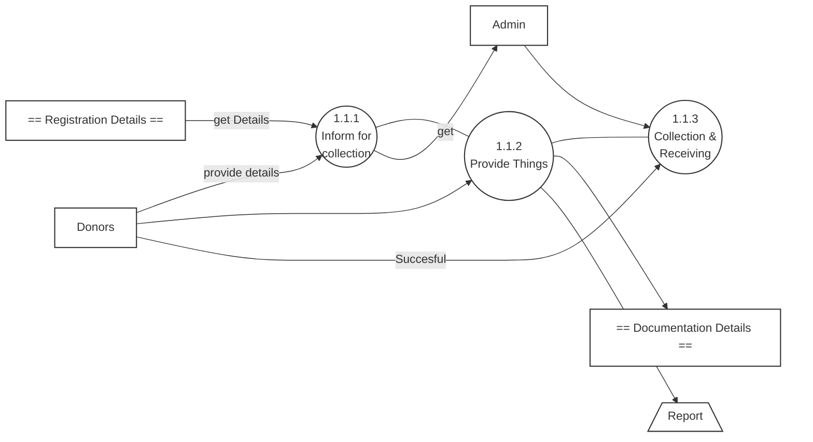
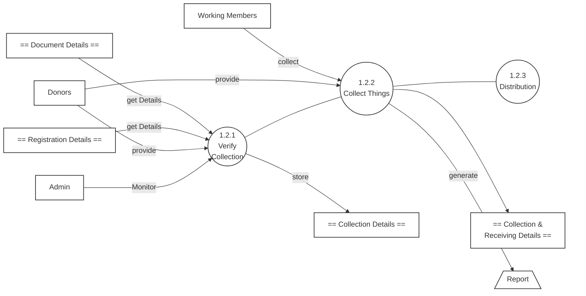
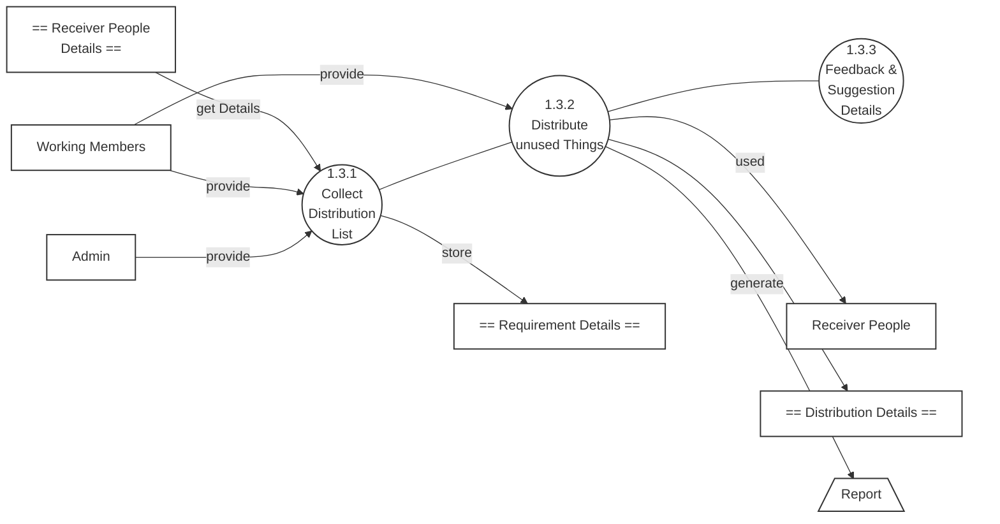
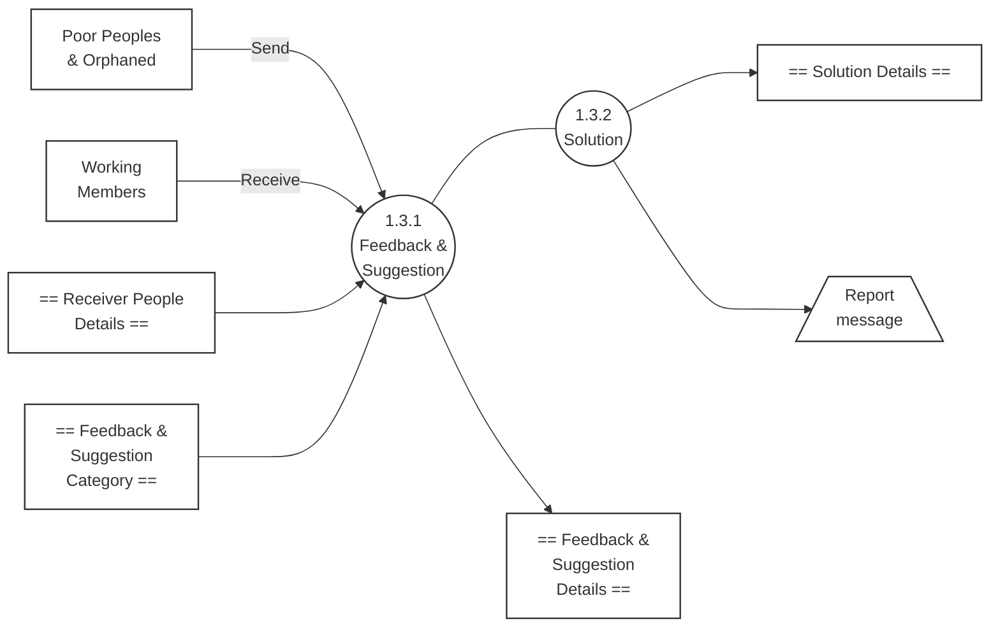
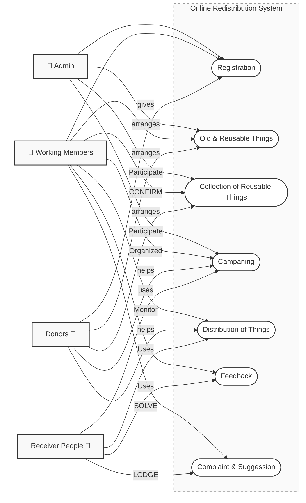

# 1

## TITLE OF THE PROJECT
"ONLINE REDISTRIBUTION OF OLD & USED THINGS FOR THE NEEDY”


## INTRODUCTION
In today's world, technology is not only about convenience and business—it can also be a powerful tool for social good. Many people have old or used items such as clothes, books, utensils, furniture, or electronic gadgets lying unused in their homes. At the same time, there are countless underprivileged people who struggle every day without access to even basic necessities. The gap between “what is wasted” and “what is needed” inspired us to design our project, “Online Redistribution of Old & Used Things for the Needy.”

The main idea of this project is to create a digital platform where individuals can donate their old and used items, and these items can then be redistributed to people in need. Instead of letting useful things go to waste, the system provides a structured way to collect, manage, and deliver them to the right beneficiaries. The platform acts as a bridge between donors and the needy, ensuring that generosity reaches the right doorstep.

We chose Python as the programming language because of its simplicity, flexibility, and wide support for web development frameworks. For the back-end, we used MySQL to store and

*Synopsis (BCA)*

# 2

manage all the important data such as donor details, item listings, requests from beneficiaries, and delivery records. Together, these technologies helped us build a system that is reliable, secure, and easy to use.

The system is designed with two main stakeholders in mind:

*   **Donors**, who can register, log in, and list the items they wish to donate.
*   **Administrators/Volunteers**, who can manage the donations, verify requests, and arrange for redistribution to the needy.

The project includes features such as user registration and authentication, item listing, request management, and delivery tracking. We also implemented basic security mechanisms like password encryption and role-based access to ensure that the system remains safe and trustworthy.

From my perspective, this project gave us the opportunity to apply our theoretical knowledge of database management, system design, and programming to a real-life social problem. It also taught us that technology is not just about profit or efficiency—it can also be about compassion, sharing, and making a difference in society.

In short, “Online Redistribution of Old & Used Things for the Needy” is not just a technical project but also a social initiative. It reflects how digital platforms can be used to reduce waste, promote reuse, and bring hope to those who need it the most. By combining technology with empathy, the project shows how small ideas can create meaningful change.

## OBJECTIVES
Every project begins with a clear set of objectives that guide its development and define its purpose. For our project, “Online Redistribution of Old & Used Things for the Needy”, the main objective is to create a digital platform that connects people who have old or unused items with those who are in need of them. Instead of letting useful things go to waste, the system provides a structured way to collect, manage, and redistribute them.

*Synopsis (BCA)*

# 3

We chose Python for its simplicity and flexibility in building applications, and MySQL for its ability to store and manage large amounts of data securely. Together, these technologies help us achieve our objectives in a practical and efficient way.

1.  **To Create a Bridge Between Donors and the Needy**
    *   The primary objective is to provide a platform where donors can list the items they no longer use, and needy individuals or organizations can request them.
    *   This ensures that resources are not wasted but instead reach those who need them most.
2.  **To Provide a User-Friendly Online Platform**
    *   The system should be simple and easy to use for both donors and administrators.
    *   Donors should be able to register, log in, and list items without technical difficulty.
3.  **To Manage Donations Efficiently**
    *   The system should allow administrators or volunteers to verify donations, approve requests, and track the redistribution process.
    *   This ensures that the process remains transparent and organized.
4.  **To Maintain a Centralized Database**
    *   All data related to donors, items, requests, and deliveries should be stored in a secure MySQL database.
    *   This helps in keeping records accurate and easily retrievable.
5.  **To Ensure Security of User Data**
    *   The system should implement authentication and password encryption to protect donor and administrator accounts.
    *   Sensitive information must remain safe from unauthorized access.
6.  **To Track and Monitor Redistribution**
    *   The system should record the status of each donation, from listing to delivery.
    *   This helps in ensuring accountability and building trust among users.
7.  **To Generate Useful Reports**
    *   The system should generate reports such as the number of items donated, number of beneficiaries served, and pending requests.

*Synopsis (BCA)*

# 4

    *   These reports help administrators evaluate the impact of the platform.
8.  **To Promote Reuse and Reduce Waste**
    *   By redistributing old and used items, the system contributes to environmental sustainability.
    *   This objective highlights the social and ecological value of the project.
9.  **To Enhance Student Learning**
    *   From our perspective as students, one of the objectives is to apply our theoretical knowledge of Python, MySQL, and system design to a real-life social problem.
    *   This project helps us gain practical experience in building a socially impactful application.

When we thought about the objectives of this project, we didn't just think about coding features—we thought about the real-life problems it could solve. For example, many people have clothes, books, or household items they no longer use, while others struggle to afford even the basics. Our objective was to create a system that makes it easy for people to share what they don't need and for the needy to receive it with dignity.

We also wanted the system to be simple, secure, and transparent. That's why we included objectives like user authentication, centralized data storage, and report generation. For us as students, these objectives also meant learning how to design a complete system that balances technical requirements with social impact.

## PROJECT CATEGORY
“Web Based RDBMS Type (Relational Database Management System) Client - Server Technology"

This project is basically categorized as ‘web based Relationship Database Management System (RDBMS)'. The project is based on three tier architecture. The three tier architecture where the application is divided into three logical constituents.

*   Presentation layer – In this layer mainly following pages contained:
    *   Web Pages
    *   User Control

*Synopsis (BCA)*

# 5

    *   Admin Control
    *   Master Pages
*   Business Layer – Business Logic,
    *   Result Engine
    *   User permissions logic
    *   Access Rights
*   Data Layer – Provide handling and validation of data (MySql in this case).
    *   MySql

## REQUIREMENT AND ANALYSIS
### EXISTING SYSTEM
*   The existing system is partial manual system because collection & distribution part does not have fully functional online for admin hence does most of the work manually.
*   This whole procedure is very tedious of time.
*   Existing system is mostly manual due to no availability of the system in the project hence the admin takes too much time to store the master information like cloths item details, stock details, no. of receiver present and absent, proper scheduling chart for collection and distribution, proper distribution plan, location plan etc.
*   It is very difficult to maintain historical data manually.
*   The following are the disadvantages of the existing system
    *   It is difficult to maintain/proper update important information in manual books.
    *   More manual hours need to generate required reports.
    *   Reports may not so accurate lime automated and will take time.
    *   It is tedious to manage historical data which needs much space to keep all the previous years' ledgers, books etc.
    *   To store large no. of historical data manually is not safe.
    *   Daily collection and distribution, stock details must be entered into books each time is very difficult to maintain.

*Synopsis (BCA)*

# 6

## PROPOSED SYSTEM
An automated online system may be advantageous –
*   High and accurate processing rate.
*   Reports are generated quickly in desired format.
*   Stock maintenance will occur correctly and dynamic.
*   Time management is well.
*   Leaving no room for human error.
*   Minimizing the wait time.
*   Admin don't need to hire more employees.
*   Improved product quality with accuracy.
*   Reduction in scheduling delays.
*   Easily store large information quickly.

## SYSTEM REQUIREMENT SPECIFICATION (SRS)
The Software Requirement Specification (SRS) is like the blueprint of a project. It clearly defines what the system should do, how it should behave, and what resources are needed to make it work. For our project, “Online Redistribution of Old & Used Things for the Needy”, the SRS helped us move from just an idea to a structured plan.

The system is designed to act as a bridge between donors and the needy. Donors can list items they no longer use, and administrators or volunteers can manage these donations and ensure they reach the right beneficiaries. By using Python for the application logic and MySQL for the database, we created a system that is simple, secure, and reliable.

### Purpose
The purpose of this project is to:

*Synopsis (BCA)*

# 7

*   Provide a platform where people can donate old and used items instead of letting them go to waste.
*   Ensure that these items are redistributed to needy individuals or organizations in an organized way.
*   Maintain a secure and centralized database of donors, items, requests, and deliveries.
*   Promote social good by combining technology with compassion.

### Scope
The scope of the *Online Redistribution of Old & Used Things for the Needy* includes:

*   A web-based application developed in Python with MySQL as the back-end.
*   Modules for donor registration, item listing, request management, and delivery tracking.
*   Role-based access for donors and administrators/volunteers.
*   Basic reporting features such as total items donated, number of beneficiaries served, and pending requests.
*   Security features like password encryption and input validation.

The system is designed for small to medium-scale use, but it can be expanded in the future to support larger communities, NGOs, or even government-backed initiatives.

## Functional Requirements
1.  **User Authentication**
    *   Secure login and registration for donors and administrators.
    *   Role-based access to features.
2.  **Donation Management**
    *   Donors can list items with details such as category, description, and condition.
    *   Administrators can approve or reject donations.
3.  **Request and Redistribution Management**
    *   Requests from needy individuals or organizations can be recorded.
    *   Administrators can match donations with requests and arrange delivery.
4.  **Delivery Tracking**

*Synopsis (BCA)*

# 8

    *   The system records the status of each donation (pending, approved, delivered).
    *   This ensures transparency and accountability.
5.  **Report Generation**
    *   Reports on total donations, beneficiaries served, and pending requests.
    *   Helps administrators evaluate the impact of the platform.

## Non-Functional Requirements
1.  **Performance**
    *   The system should handle multiple donors and requests simultaneously.
2.  **Security**
    *   Passwords must be encrypted before storage.
    *   Unauthorized access should be prevented.
3.  **Usability**
    *   The interface should be simple and intuitive for both donors and administrators.
4.  **Reliability**
    *   Data should be stored consistently without loss or corruption.
5.  **Maintainability**
    *   The system should be modular so that future enhancements can be added easily.

## Hardware and Software Requirements
*   **Hardware Requirements**
    *   Processor: Intel i3 or higher
    *   RAM: 4 GB or higher
    *   Hard Disk: 250 GB or higher
    *   Internet connection
*   **Software Requirements**
    *   Front-end: HTML, CSS, JavaScript (with Python for server-side scripting)
    *   Back-end: MySQL
    *   Web Server: Apache or Flask/Django environment
    *   Operating System: Windows/Linux

*Synopsis (BCA)*

# 9

When we prepared the SRS, we thought of it as a roadmap for our project. Instead of jumping straight into coding, we first asked ourselves: What exactly should the system do? Who will use it? What problems should it solve? Writing down these answers gave us clarity and direction.

For example, we realized that donors and administrators would need different types of access, so we included role-based authentication. We also understood that reports would be useful for administrators, so we added report generation as a requirement. By doing this, we avoided confusion later and made sure our project stayed focused on solving real problems.

## CHARTS USED:
### PERT chart:
#### Introduction
In software development, proper planning is just as important as coding. If we start building a system without knowing the sequence of tasks, we may end up wasting time or missing deadlines. To avoid this, project management tools like the PERT Chart (Program Evaluation and Review Technique) are used.

For our project, “Online Redistribution of Old & Used Things for the Needy”, the PERT chart helped us break down the entire development process into smaller activities, arrange them in a logical order, and identify which tasks depended on others. It gave us a clear picture of the critical path—the sequence of activities that directly determined the overall project duration.

#### Activities in the PERT Chart
The main activities we identified for our project were:

1.  **Requirement Analysis**
    *   Understanding the needs of donors, administrators, and beneficiaries.
    *   Listing the features required, such as donor registration, item listing, request management, and delivery tracking.
2.  **System Design**

*Synopsis (BCA)*

# 10

    *   Designing the database schema in MySQL.
    *   Creating flowcharts, data flow diagrams, and planning the user interface.
3.  **Module Development**
    *   Developing individual modules such as:
        *   User Authentication and Registration
        *   Donation Management
        *   Request and Redistribution Management
        *   Delivery Tracking
        *   Report Generation
4.  **Integration**
    *   Combining all modules into a single working system.
    *   Ensuring smooth data flow between the Python front-end and the MySQL back-end.
5.  **Testing**
    *   Performing unit testing for each module.
    *   Conducting integration testing to check how modules work together.
    *   Carrying out system testing to ensure the entire application works as expected.
6.  **Documentation**
    *   Preparing the project report, user manual, and synopsis.
    *   Documenting the design, coding, and testing process.
7.  **Deployment and Demonstration**
    *   Hosting the system on a local server.
    *   Demonstrating the project to faculty and evaluators.

When we created the PERT chart, we thought of it as a roadmap for our journey. It showed us not only what tasks we had to complete but also the order in which they had to be done. For example, we could not start coding the modules before finishing the system design, and we could not test the system before integrating all the modules.

The PERT chart also helped us identify which tasks could be done in parallel. For instance, while one team member worked on the authentication module, another could start developing the donation management module. This saved us time and made the project more efficient.

*Synopsis (BCA)*

# 11

Most importantly, the PERT chart gave us confidence. Instead of feeling overwhelmed by the size of the project, we could see it broken down into smaller, achievable steps. It reminded us that completing a project is like climbing a staircase—one step at a time.


### Gantt Chart:
While the PERT chart helped us understand the logical sequence of tasks and their dependencies, the Gantt chart gave us a clear time-based schedule for our project. A Gantt chart is essentially a timeline that shows when each activity starts, how long it will take, and when it is expected to finish. For our project, “Online Redistribution of Old & Used Things for the Needy”, the Gantt chart acted like a calendar that kept us on track and ensured that we completed each stage within the given timeframe.

*Synopsis (BCA)*

# 12

#### Activities and Timeline
We divided our project into different phases and assigned each phase a duration. The Gantt chart showed these activities as horizontal bars across a timeline. Below is the breakdown of our schedule:

1.  **Requirement Analysis (Week 1 – Week 2)**
    *   Understanding the needs of donors, administrators, and beneficiaries.
    *   Listing the features required such as donor registration, item listing, request management, and delivery tracking.
2.  **System Design (Week 3 – Week 4)**
    *   Designing the database schema in MySQL.
    *   Creating flowcharts, data flow diagrams, and planning the user interface.
3.  **Module Development (Week 5 – Week 8)**
    *   Developing modules such as:
        *   User Authentication and Registration
        *   Donation Management
        *   Request and Redistribution Management
        *   Delivery Tracking
        *   Report Generation
4.  **Integration (Week 9)**
    *   Combining all modules into a single working system.
    *   Ensuring smooth data flow between Python and MySQL.
5.  **Testing (Week 10 – Week 11)**
    *   Performing unit testing, integration testing, and system testing.
    *   Checking for errors and ensuring the system works as expected.
6.  **Documentation (Week 12)**
    *   Preparing the project report, user manual, and synopsis.
    *   Documenting the design, coding, and testing process.
7.  **Deployment and Demonstration (Week 13)**
    *   Hosting the system on a local server.
    *   Demonstrating the project to faculty and evaluators.

*Synopsis (BCA)*

# 13

When we created the Gantt chart, it felt like we were planning a journey with a clear timetable. It showed us not only what tasks we had to complete but also when we had to complete them. For example, we knew that requirement analysis had to be finished in the first two weeks, otherwise the design phase would be delayed.

The Gantt chart also showed us where tasks could overlap. For instance, while one team member was working on the authentication module, another could simultaneously start on the donation management module. This parallel work saved us time and made the project more efficient.

Most importantly, the Gantt chart gave us discipline. Instead of working randomly, we had a structured schedule to follow. Whenever we felt stuck, the chart reminded us of the deadlines and helped us stay focused.


*Synopsis (BCA)*

# 14

## SOFRWARE & HARDWARE REQUIREMENTS
This is a few requirement need to be fulfill in order to make this application possible. The requirement consists of software requirement that is used to develop and execute the application, hardware requirement that is used to support the development and execution process and others.

### SOFTWARE ENVIRONMENT:
Front End GUI Tools : HTML5, CSS3
Back End Language Tools : Python 3.7.4
Back End Database Tools : MySql 5.0.12
IDE Platform Tools : Pycharm 3.5
Web Server Software : Apache 8.2
Web Framework Environment : Django 3.0
Operating System : Windows 10 Pro
Documentation Editor Tools : MS- Word 2016

### HARDWARE ENVIRONMENT:
CPU : Intel core2duo processor, 1.7GHz
RAM : 2 GB/More
HARD DISK : 160 GB/More
DVD WRITER : 8X
PINTER : Inkjet

*Synopsis (BCA)*

# 15

## SYSTEM DESIGN
### STRUCTURE CHART

Structure Chart for "Old & Used Things" project. "Old & Used Things" branches into "Unused Things Master Module", "Donator/Receiver People Registration Detail", "Donator People Master Module", "Receiver People Master Module", "Collection Detail Module", "Distribution Detail Module", "Stock Details Module", "Complaint & Suggestion Master Module", and "Contact Us Detail Module". These further branch into specific master categories like "Clothes Master", "Books & Stationary Master", "Utensils Master", "Furniture Master", "Place Master", and "Unused Things Category Master".



*Synopsis (BCA)*

# 16

## E-R DIAGRAM

Entity-Relationship Diagram: "Online Redistribution of Old and Used Things For the Needy". Entities include Donor, Receiver People, Admin, Working Member, and Unused Things. Relationships show Donors making requests, donating/providing Unused Things, and having Registration. Unused Things are used by Receiver People and collected by Working Members. Admin has relationships with Donor (Registration, requests), Working Member, and handles Suggestions & Feedback.



*Synopsis (BCA)*

# 17

## DATA FLOW DIAGRAM (DFD)
### Online Redistribution of Used and Old Things for the Needy

Data Flow Diagram (DFD) Level 0 for "Online Redistribution of Used & Old Things for the Needy". External entities Admin, Working Members, Receiver People, and Donors interact with the central process. Outputs include Registration Confirm, Service, and Report



### Level 1

Data Flow Diagram (DFD) Level 1. External entities Donor, Admin, Working Members, and Receiver People interact with processes 1.0 Registration, 1.1 Unused Materials, 1.2 Collection & Receiving, 1.2 Distribution, and 1.3 Feedback & Suggestions. Data flows include requests, provide, confirm, get update/listed, monitor, work, uses, give, review, Registration, Report, Unused Things Details, Collection Details, Distribution Details, Feedback & Suggestion Details.


*Synopsis (BCA)*

# 19

### LEVEL 2: Registration
Data Flow Diagram (DFD) Level 2 for Registration. Donors "Form fill up" process 1.0.1 Form collection. Basic criteria is an input to Form collection. Working Members receive output from Form collection. Process 1.0.2 Filteration receives input from Donors and Form collection. Process 1.0.3 Verification receives input from Filteration. Admin and Terms and condition are inputs/outputs for Verification. Process 1.0.4 Final Registration receives input from Verification. Process 1.0.5 Unused Material receives input from Final Registration. "Successful" data flow connects Donors to Filteration.



*Synopsis (BCA)*

# 20


### LEVEL 2 : Unused Things

Data Flow Diagram (DFD) Level 2 for Unused Things. Admin "get" process 1.1.1 Inform for collection. "get Details" links to Registration Details. Donors "provide details" to process 1.1.2 Provide Things. Documentation Details and Report are outputs from Provide Things. "Succesful" data flow connects Donors to Process 1.1.3 Collection & Receiving, which also receives input from Provide Things.


*Synopsis (BCA)*

# 21

### LEVEL 2: Collection & Receiving

Data Flow Diagram (DFD) Level 2 for Collection & Receiving. Admin "Monitor" process 1.2.1 Verify Collection. "get Details" links to Registration Details and Document Details. "store" links to Collection Details. Donors "provide" to process 1.2.2 Collect Things. Working Members "collect" from Collect Things. Collect Things "provide" to Verify Collection. Collection & Receiving Details and Report (via "generate") are outputs from Collect Things. Process 1.2.3 Distribution receives input from Collect Things.



*Synopsis (BCA)*

# 22

### LEVEL 2: Distribution

Data Flow Diagram (DFD) Level 2 for Distribution. Admin "provide" to process 1.3.1 Collect Distribution List. "get Details" links to Receiver People Details. "store" links to Requirement Details. Working Members "provide" to process 1.3.2 Distribute unused Things. Receiver People "used" from Distribute unused Things. "generate" links to Distribution Details and Report from Distribute unused Things. Process 1.3.3 Feedback & Suggestion Details receives input from Distribute unused Things.


*Synopsis (BCA)*

# 23

### LEVEL 2: Feedback & Suggestion

![Data Flow Diagram (DFD) Level 2 for Feedback & Suggestion. Poor Peoples & Orphaned "Send" to process 1.3.1 Feedback & Suggestion. Working Members "Receive" from Feedback & Suggestion. Outputs from Feedback & Suggestion include Receiver People Details, Feedback & Suggestion Category, and Feedback & Suggestion Details. Process 1.3.2 Solution receives input from Feedback & Suggestion. Outputs from Solution include Solution Details and Report message.



*Synopsis (BCA)*

# 24

## USE CASE DIAGRAM

Use Case Diagram for Online Redistribution of Old & Used Things for the Needy. Actors are Admin, Working Members, Donors, and Receiver People. Use cases include Registration, Old & Reusable Things, Collection of Reusable Things, Campaning, Distribution of Things, Feedback, and Complaint & Suggestion. Relationships show participation, arrangement, giving, helping, confirming, organizing, monitoring, solving, and lodging actions between actors and use cases.

*Synopsis (BCA)*

# 25

## NO. OF MODULES AND ITS DESCRIPTION
To make a large system easier to design, develop, and maintain, it is divided into smaller, manageable parts called modules. Each module focuses on a specific function of the system, and together they form the complete application. In our project, “Online Redistribution of Old & Used Things for the Needy”, we identified the main activities of an online donation and redistribution platform and converted them into modules. This modular approach not only made development easier but also helped us test and debug each part separately before integrating them into the final system.

### Major Modules of the System
1.  **User Authentication and Registration Module**
    *   This module handles secure login and registration for donors, administrators, and volunteers.
    *   It ensures that only authorized users can access the system.
    *   Passwords are stored in encrypted form to maintain security.
2.  **Donation Management Module**
    *   Donors can list the items they wish to donate, along with details such as category, description, and condition.
    *   Administrators can review and approve these donations before making them available for redistribution.
3.  **Request and Redistribution Module**
    *   Requests from needy individuals or organizations are recorded here.
    *   Administrators or volunteers can match donations with requests and arrange for delivery.
    *   This module ensures that items reach the right beneficiaries.
4.  **Delivery Tracking Module**
    *   Tracks the status of each donation, from approval to delivery.
    *   Helps administrators and donors know whether an item has been successfully delivered.

*Synopsis (BCA)*

# 26

5.  **Report Generation Module**
    *   Generates reports such as the number of items donated, number of beneficiaries served, and pending requests.
    *   These reports help administrators evaluate the impact of the platform and plan improvements.
6.  **Administration Module**
    *   Provides administrators with tools to manage users, donations, requests, and reports.
    *   Ensures smooth functioning of the system and prevents misuse.

Thus, when we divided our project into these modules, it became much easier to work as a team. Each of us could focus on one module at a time—for example, one person worked on the login system while another worked on the donation management module. Later, we combined all the modules to form the complete system.

This modular approach also reflects how a real online donation platform works. In real life, one part of the system handles user accounts, another manages donations, another processes requests, and another generates reports. Similarly, our project modules represent these real-world tasks, which makes the system practical and easy to understand.

## DATABASE DESIGN
A great many information system, weather on large or small computer system, interact with database that spans multiple applications. Because of the importance of database to many systems, their design is established and monitored with great devotion.

Every business enterprise maintains large volumes of data for its operations. With more and more people accessing this data for their work the need to maintain its integrity and relevance increases. Normally, with the traditional methods of storing data and information in files, the chances that the data loses its integrity and validity are high.

*Synopsis (BCA)*

# 27

## Table Name: Used and Old Things master
```
| Slno. | Fields /Attribute Name | Data Type(Size) | Constraints  | Descriptions     |
| :---- | :--------------------- | :-------------- | :----------- | :--------------- |
| 1.    | SLNO                   | Int[10]         | Unique Key   | Serial No        |
| 2.    | PRDCTID                | Int[10]         | Primary Key  | Product Id       |
| 3.    | PRONAME                | Varchar[30]     | Not Null     | Product Name     |
| 4.    | CATEGORY               | Varchar[30]     | Not Null     | Category         |
| 5.    | SUBCAT                 | Varchar[30]     | Not Null     | Sub-Category     |
| 6.    | PROSLNO                | Varchar[30]     | Not Null     | Product Serial No|
| 7.    | BATCHNO                | Varchar[30]     | Not Null     | Batch Number     |
| 8.    | PURDT                  | Date            | Not Null     | Purchase Date    |
| 9.    | STATUS                 | Varchar[30]     | Not Null     |                  |
| 10.   | Remarks                | Varchar[20]     | Null         | Remarks          |
```
## Table Name: Donator Module
```
| Slno. | Fields /Attribute Name | Data Type(Size) | Constraints | Descriptions    |
| :---- | :--------------------- | :-------------- | :---------- | :-------------- |
| 1.    | SLNO                   | Int[10]         | Unique Key  | Serial No       |
| 2.    | DID                    | Varchar[50]     | Primary Key | User Id         |
| 3.    | PSD                    | Varchar(20)     | Not Null    | Password        |
| 4.    | CPSD                   | Varchar(20)     | Not Null    | Confirm Password|
| 5.    | DNM                    | Varchar(50)     | Not Null    | Donator Name    |
| 6.    | DOB                    | Varchar[50]     | Not Null    | Date Of Birth   |
| 7.    | GEN                    | Varchar[50]     | Not Null    | Gender          |
| 8.    | MOB                    | Varchar[50]     | Not Null    | Mobile Number   |
| 9.    | EMAIL                  | Varchar(20)     | Not Null    | Email Id        |
| 10.   | ADDRS1                 | Varchar(100)    | Not Null    | Address Line 1  |
| 11.   | ADDRS2                 | Varchar(100)    | Not Null    | Address Line 2  |
```
*Synopsis (BCA)*

# 28
```
| 12. | CITY    | Varchar(30) | Not Null | City        |
| :-- | :------ | :---------- | :------- | :---------- |
| 13. | STATE   | Varchar(20) | Not Null | State       |
| 14. | PNCD    | Varchar(30) | Null     | Pin Code    |
| 15. | Remarks | Varchar[20] | Null     | Remarks     |
```
## Table Name: Receiver Module
```
| Slno. | Fields /Attribute Name | Data Type(Size) | Constraints | Descriptions     |
| :---- | :--------------------- | :-------------- | :---------- | :--------------- |
| 1.    | SLNO                   | Int[10]         | Unique Key  | Serial No        |
| 2.    | RID                    | Varchar[50]     | Primary Key | Receiver User Id |
| 3.    | PSD                    | Varchar(20)     | Not Null    | Password         |
| 4.    | CPSD                   | Varchar(20)     | Not Null    | Confirm Password |
| 5.    | RNM                    | Varchar(50)     | Not Null    | Receiver Name    |
| 6.    | DOB                    | Varchar[50]     | Not Null    | Date Of Birth    |
| 7.    | GEN                    | Varchar[50]     | Not Null    | Gender           |
| 8.    | MOB                    | Varchar[50]     | Not Null    | Mobile Number    |
| 9.    | EMAIL                  | Varchar(20)     | Not Null    | Email Id         |
| 10.   | ADDRS1                 | Varchar(100)    | Not Null    | Address Line 1   |
| 11.   | ADDRS2                 | Varchar(100)    | Not Null    | Address Line 2   |
| 12.   | CITY                   | Varchar(30)     | Not Null    | City             |
| 13.   | STATE                  | Varchar(20)     | Not Null    | State            |
| 14.   | PNCD                   | Varchar(30)     | Null        | Pin Code         |
| 15.   | Remarks                | Varchar[20]     | Null        | Remarks          |
```
## Table Name: Collections Details
```
| Slno. | Fields /Attribute Name | Data Type(Size) | Constraints | Descriptions |
| :---- | :--------------------- | :-------------- | :---------- | :----------- |
| 1.    | SLNO                   | Int[10]         | Unique Key  | Serial No    |
| 2.    | PRDCTID                | Int[10]         | Primary Key | Product Id   |
```
*Synopsis (BCA)*

# 29
```

| 3.  | PRONAME      | Varchar[30]  | Not Null | Product Name      |
| :-- | :----------- | :----------- | :------- | :---------------- |
| 4.  | CATEGORY     | Varchar[30]  | Not Null | Category          |
| 5.  | SUBCAT       | Varchar[30]  | Not Null | Sub-Category      |
| 6.  | PROSLNO      | Varchar[30]  | Not Null | Product Serial No |
| 7.  | BATCHNO      | Varchar[30]  | Not Null | Batch Number      |
| 8.  | QTY          | Varchar[10]  | Not Null |                   |
| 9.  | RECDT        | Date         | Not Null | Receiving Date    |
| 10. | STATUS       | Varchar[30]  | Not Null |                   |
| 11. | DONATEDBY    | Varchar[50]  | Not Null |                   |
| 12. | DADDRESS     | Varchar[150] | Not Null |                   |
| 13. | RECEIVEDBY   | Varchar[50]  | Not Null |                   |
| 14. | REMARKS      | Varchar[150] | Not Null |                   |

```

## Table Name: Redistribution Details
``` 
| Slno. | Fields /Attribute Name | Data Type(Size) | Constraints | Descriptions      |
| :---- | :--------------------- | :-------------- | :---------- | :---------------- |
| 1.    | SLNO                   | Int[10]         | Unique Key  | Serial No         |
| 2.    | PRDCTID                | Int[10]         | Primary Key | Product Id        |
| 3.    | PRONAME                | Varchar[30]     | Not Null    | Product Name      |
| 4.    | CATEGORY               | Varchar[30]     | Not Null    | Category          |
| 5.    | SUBCAT                 | Varchar[30]     | Not Null    | Sub-Category      |
| 6.    | PROSLNO                | Varchar[30]     | Not Null    | Product Serial No |
| 7.    | BATCHNO                | Varchar[30]     | Not Null    | Batch Number      |
| 8.    | QTYDISTRIBUTE          | Varchar[10]     | Not Null    |                   |
| 9.    | DISDT                  | Date            | Not Null    |                   |
| 10.   | PLACE                  | Varchar[80]     | Not Null    |                   |
| 11.   | DISBY                  | Varchar[50]     | Not Null    |                   |
| 12.   | RECNAME                | Varchar[50]     | Not Null    |                   |
| 13.   | RECADDRESS             | Varchar[150]    | Not Null    |                   |
| 14.   | RECMOB                 | Varchar[15]     | Not Null    |                   |
| 15.   | OTY                    | Varchar[15]     |             |                   |
| 16.   | DISBY                  | Varchar[50]     | Not Null    |                   |
```
*Synopsis (BCA)*

# 30
```
| 17. | REMARKS | Varchar[150] | Not Null | |
```
## Table Name: Stock Details
```

| Slno. | Fields /Attribute Name | Data Type(Size) | Constraints | Descriptions      |
| :---- | :--------------------- | :-------------- | :---------- | :---------------- |
| 1.    | SLNAME                 | Int[10]         | Unique Key  | Serial No         |
| 2.    | PRDCTID                | Int[10]         | Primary Key | Product Id        |
| 3.    | PRONAME                | Varchar[30]     | Not Null    | Product Name      |
| 4.    | CATEGORY               | Varchar[30]     | Not Null    | Category          |
| 5.    | PROSLNO                | Varchar[30]     | Not Null    | Product Serial No |
| 6.    | BATCHNO                | Varchar[30]     | Not Null    | Batch Number      |
| 7.    | DISAMT                 | Varchar[30]     | Not Null    |                   |
| 8.    | STOCKAMT               | Varchar[30]     | Not Null    |                   |
| 9.    | Remarks                | Varchar[20]     | Null        | Remarks           |
```
## Table Name: Suggestions & Complaints Details
```
| Slno. | Fields/Attribute Name | Data Type(Size) | Constraints | Descriptions         |
| :---- | :-------------------- | :-------------- | :---------- | :------------------- |
| 1.    | SLNO                  | Varchar(20)     | Primary Key | Serial Number        |
| 2.    | DRID                  | Varchar(50)     | Not Null    | Donator/Receiver Id  |
| 3.    | SCOMPDT               | Varchar(50)     | Not Null    | Complaint Date       |
| 4.    | ISSUTYPE              | Varchar(50)     | Not Null    | Issue Type           |
| 5.    | COMPDETAILS           | Varchar(500)    | Not Null    | Complaint Content    |
| 6.    | REMARKS               | Varchar(200)    | Null        | Remarks              |
```
## Table Name: Contact Us Details
```
| Slno. | Fields /Attribute Name | Data Type(Size) | Constraints | Descriptions  |
| :---- | :--------------------- | :-------------- | :---------- | :------------ |
| 1.    | SLNO                   | Varchar(20)     | Primary Key | Serial Number |
```
*Synopsis (BCA)*

# 31
```
| 2.  | ADMINID   | Varchar(50)  | Not Null | Admin Id    |
| :-- | :-------- | :----------- | :------- | :---------- |
| 3.  | COMNAME   | Varchar(50)  | Not Null | Company Name|
| 4.  | CEMAIL    | Varchar(50)  | Not Null | Email Id    |
| 5.  | COMPADDR  | Varchar(200) |          |             |
| 6.  | COMPMOB   | Varchar(50)  |          |             |
| 7.  | REMARKS   | Varchar(200) | Null     |             |
```
## PROCESS LOGIC OF THE MODULE
1.  **Used and Old Things Master Module**
    This module contains the details of unused old things which are useless for some people but are valuable and usable for other people. This module contains the name, category, sub category, company name, use etc details of unused things master records which can be used by the admin later.
2.  **Donator/Receiver People Registration Detail**
    This module contains the master information of donator or receiver people in the form of registration who are mainly involved in donating/receiving unused old things to/from the admin.This module contains the name, product name, category, sub category, company name, date etc details of unused things as master records donated/received by people which can be used by the admin later in various managerial work.
3.  **Donator People Master Module**
    This module contains the master information of donator people who are mainly involved in donating unused old things to the admin. This module contains the name of donator, address, product name, category, sub category, company name, date of donation, quantity etc details of unused things as master records donated which can be used by the admin later in other managerial work such as in distribution or stock management.
4.  **Receiver People Master Module**

*Synopsis (BCA)*

# 32

This module contains the master information of receiver poor people who are mainly involved in getting unused old things by the admin when distribution of these will occur. This module contains the name of receiver, address, product name, category, sub category, company name, date of receiving, quantity etc details of unused things as master records donated which can be used by the admin later in other managerial work such as in distribution details or stock management.

5.  **Collection Detail Module**
    This module contains the master information of receiving old unused things by the admin or its team time to time when information is available. This module stores the information as master record such as the name of donator, address, product name, category, sub category, product company name, date of receiving, quantity etc details of unused things as master records donated which can be used by the admin later in other managerial work such as in stock management.
6.  **Distribution Detail Module**
    This module contains the master information of distribution details of old unused things by the admin or its team time to time to the receiver person in various regions when stock is available. This module stores the information as main processing master record for future use such as the name of receiver, address, received product name, category, sub category, product company name, date of distribution, quantity of stock etc details of unused things as master records donated by the admin. This record can be used by the admin later in knowing other managerial work details such as in stock management.
7.  **Stock Details Module**
    This module contains the master information of stock details of old unused things present at that moment in admin stock. This information helps the admin to arrange collection or distribution process. This module stores the information as other main processing master record for processing work and these information as the name of products, category, sub category, product company name, date of collection, date of distribution, quantity of stock etc details of unused things as master records present in the stock. This record can

*Synopsis (BCA)*

# 33

be used by the admin later in knowing other details of managerial work such as in distribution management.

## TYPES OF TESTING
Testing is one of the most important stages in software development. It ensures that the system we build is not only functional but also reliable, secure, and user-friendly. For our project, “Online Redistribution of Old & Used Things for the Needy”, testing was especially important because the system deals with sensitive data such as donor details, item listings, and redistribution records. If the system fails, it could lead to confusion, data loss, or even misuse of donations.

As students, we understood that testing is not just about “finding errors" but about building confidence that the system works as intended. That is why we implemented different types of testing at various stages of development.

### Types of Testing Implemented
1.  **Unit Testing**
    *   Each module of the system was tested individually to ensure it worked correctly on its own.
    *   For example, we tested the login module to check if it validated usernames and passwords properly.
    *   Similarly, we tested the donation management module to ensure that items could be added, updated, and deleted without errors.
    *   Unit testing helped us catch small mistakes early before they affected the whole system.
2.  **Integration Testing**
    *   After unit testing, we combined modules and tested how they worked together.
    *   For example, we checked whether an item listed by a donor in the donation module was correctly visible in the redistribution module.

*Synopsis (BCA)*

# 34

    *   We also tested whether delivery tracking updated properly once an item was marked as delivered.
    *   Integration testing ensured smooth data flow between the Python front-end and the MySQL back-end.
3.  **System Testing**
    *   In this stage, we tested the entire system as a whole.
    *   We acted like real users and performed tasks such as registering as a donor, listing an item, approving a request, and tracking delivery.
    *   This helped us confirm that the system met the requirements defined in the SRS.
4.  **User Interface (UI) Testing**
    *   Since the system is meant for everyday users, we tested the interface for simplicity and ease of use.
    *   We checked whether buttons, forms, and menus worked properly and whether the layout was clear.
    *   This type of testing helped us make the system practical and user-friendly.
5.  **Performance Testing**
    *   We tested how the system performed when multiple users were browsing or listing items at the same time.
    *   We also checked how quickly the system retrieved data from the database.
    *   Performance testing gave us confidence that the system could handle real-world usage without slowing down.
6.  **Security Testing**
    *   Since the system involves user accounts and donation records, we tested the login and authentication module for security.
    *   We checked whether unauthorized users could access the system and whether passwords were stored securely.

*Synopsis (BCA)*

# 35

    *   This ensured that sensitive data remained protected.

Thus, when we carried out testing, we thought of ourselves as both developers and end-users. As developers, we wanted to make sure the code was correct. As end-users, we wanted to see if the system was easy to use and trustworthy.

For example, when we tested the donation module, we didn't just check if the item was saved—we also checked if the details were displayed correctly to administrators. When we tested the login system, we didn't just check if it worked—we also tried entering wrong passwords to see if the system blocked us.

This approach made testing more practical and meaningful, and it gave us confidence that our project was not only functional but also reliable.

*Synopsis (BCA)*

# 36

## SECURITY ISSUES
In any online system, especially one that deals with personal details and sensitive information, security is not optional—it is essential. Our project, “Online Redistribution of Old & Used Things for the Needy”, involves storing donor details, item listings, requests from beneficiaries, and delivery records. If this data is not protected, it could lead to misuse, unauthorized access, or even loss of trust in the platform.

As students, we realized that building a working system was only half the job. The other half was making sure that the system was safe, reliable, and trustworthy. That is why we implemented several security mechanisms using Python and MySQL to protect the data and ensure that only authorized users can access the system.

### Security Mechanisms Implemented
1.  **User Authentication**
    *   Every user (donor, administrator, or volunteer) must log in with a valid username and password.
    *   Credentials are verified against the MySQL database before granting access.
    *   This ensures that only registered users can use the system.
2.  **Password Encryption**
    *   Passwords are not stored in plain text.
    *   We used hashing techniques in Python to encrypt passwords before saving them in the database.
    *   Even if the database is accessed by outsiders, the actual passwords remain safe.
3.  **Role-Based Access Control**
    *   Different users have different levels of access.
    *   For example, administrators can approve donations and generate reports, while donors can only list items.

*Synopsis (BCA)*

# 37

    *   This prevents misuse of features and ensures that each user only sees what they are supposed to.
4.  **Input Validation and Sanitization**
    *   All user inputs (such as login details, item descriptions, and requests) are validated and sanitized in Python before being stored in MySQL.
    *   This prevents SQL injection attacks and ensures that only clean and valid data is processed.
5.  **Session Management**
    *   Once a user logs in, a secure session is created.
    *   The session automatically expires after a period of inactivity, reducing the risk of misuse if the user forgets to log out.
6.  **Error Handling**
    *   The system does not display technical error messages directly to users, as this could reveal sensitive information about the database or code.
    *   Instead, it shows simple, user-friendly messages while logging the technical details internally for administrators.
7.  **Data Integrity and Backup Provision**
    *   The system ensures that data entered into the database cannot be altered without authorization.
    *   While automated backup was not fully implemented in this version, provisions are made for manual backups to protect against accidental data loss.

Thus, when we thought about security, we imagined what could go wrong if the system was left unprotected. For example, if anyone could log in without authentication, donations could be tampered with. If passwords were stored as plain text, they could be stolen easily. If inputs were not validated, someone could try to break the system with harmful code.

*Synopsis (BCA)*

# 38

That's why we added these security mechanisms step by step. We didn't aim to make it as advanced as a banking system, but we wanted it to be safe enough for an online redistribution platform. For us, it was also a learning experience—understanding how small measures like password hashing, role-based access, or session timeouts can make a big difference in protecting data.

## REPORT GENERATION
In any information system, simply storing data is not enough. The real usefulness of the system comes when this data is presented in a meaningful way that helps users and administrators make decisions. For our project, “Online Redistribution of Old & Used Things for the Needy”, we realized that report generation was an essential feature. Reports allow administrators to track donations, monitor requests, and evaluate the overall impact of the platform. They also provide transparency and accountability, which are very important in a system that deals with social service and redistribution.

By using Python for processing and MySQL for data storage, we designed a reporting feature that can extract information from the database and present it in a structured format. These reports are dynamic, meaning they always reflect the latest data stored in the system.

### Types of Reports Generated
1.  **Donation Report**
    *   Shows the total number of items donated over a specific period (daily, monthly, or yearly).
    *   Helps administrators analyze donation trends and identify active donors.
2.  **Beneficiary Report**
    *   Provides details of the individuals or organizations who received items.
    *   Includes information such as beneficiary name, items received, and delivery date.
    *   Useful for ensuring that donations are reaching the right people.
3.  **Item-Wise Report**

*Synopsis (BCA)*

# 39

    *   Displays the performance of individual categories of items such as clothes, books, utensils, or furniture.
    *   Shows how many units of each category were donated and redistributed.
    *   Helps administrators identify which types of items are in high demand.
4.  **Pending Request Report**
    *   Lists all requests from beneficiaries that are still pending.
    *   Helps administrators prioritize and manage redistribution more effectively.
5.  **Delivery Status Report**
    *   Tracks the status of each donation (pending, approved, delivered).
    *   Ensures transparency in the redistribution process and helps avoid delays.
6.  **Overall Summary Report**
    *   Provides a consolidated view of total donations, total beneficiaries served, and pending requests.
    *   Useful for top-level decision-making and evaluating the social impact of the platform.

Thus, when we designed the report generation feature, we thought about what kind of information would actually be useful in real life. For example, an administrator would want to know which items are being donated the most, which beneficiaries are receiving help regularly, and whether there are any pending requests. Instead of going through hundreds of records manually, the system can generate these reports automatically in just a few clicks.

For us as students, this was one of the most exciting parts of the project. It showed us how raw data in a database can be transformed into meaningful insights. We also learned that reports are not just about numbers—they are about helping people make better decisions and ensuring that the redistribution process remains fair and transparent.

## LIMITATION AND FUTURE SCOPE OF THE PROJECT
No project is ever perfect in its very first version. Every system has certain limitations, either because of time constraints, limited resources, or the scope defined at the student level. At the same time, these limitations open up opportunities for future improvements and expansion. Our

*Synopsis (BCA)*

# 40

project, “Online Redistribution of Old & Used Things for the Needy”, successfully provides a platform for donors to list items and for administrators to manage redistribution. However, we also recognize the areas where the system can be improved and extended in the future.

### Limitations of the Project
1.  **Basic Payment/Transaction Handling**
    *   The current system does not support any financial transactions, since it is focused only on redistribution of items.
    *   If NGOs or delivery partners are involved, there is no built-in mechanism to handle service charges or donations.
2.  **Limited Security Features**
    *   While we implemented authentication and password hashing, advanced features such as two-factor authentication, SSL encryption, or biometric login are not included.
3.  **No Mobile Application**
    *   The system is web-based and works best on desktops or laptops.
    *   There is no dedicated mobile app, which limits accessibility for users who prefer smartphones.
4.  **Basic Reporting**
    *   The system generates simple reports such as donation summaries and pending requests.
    *   It does not provide advanced analytics like graphical dashboards, trend analysis, or predictive insights.
5.  **Manual Backup**
    *   Data is stored securely in MySQL, but there is no automated backup or recovery mechanism.
    *   In case of accidental data loss, recovery would depend on manual backups.
6.  **Scalability Constraints**
    *   The system works well for small to medium-sized communities.
    *   It may not handle very large volumes of data or complex workflows required by big NGOs or government programs.

*Synopsis (BCA)*

# 41

7.  **Limited Communication Features**
    *   The system does not include automated notifications (email or SMS) for donation approvals, delivery updates, or reminders.

### Future Scope of the Project
1.  **Integration with Mobile Applications**
    *   A dedicated mobile app for Android and iOS can be developed.
    *   This would allow donors and volunteers to access the system anytime, anywhere.
2.  **Advanced Security Features**
    *   Features like two-factor authentication, SSL encryption, and biometric login can be added.
    *   This would make the system more secure and trustworthy.
3.  **Cloud Deployment**
    *   Hosting the system on cloud platforms like AWS or Azure would make it more scalable and accessible globally.
    *   Cloud deployment would also provide automatic backups and better reliability.
4.  **Automated Notifications**
    *   Email and SMS notifications can be added for donation confirmations, delivery updates, and reminders.
    *   This would improve communication and user satisfaction.
5.  **Integration with Logistics Partners**
    *   The system can be integrated with delivery services to automate pickup and drop-off of donated items.
    *   This would make redistribution faster and more efficient.
6.  **Advanced Reporting and Analytics**
    *   The system can be enhanced with graphical dashboards, charts, and predictive analytics.
    *   This would help administrators and NGOs make better decisions.
7.  **Multi-NGO and Multi-Branch Support**
    *   The system can be expanded to support multiple NGOs or branches under one platform.

*Synopsis (BCA)*

# 42

    *   This would make it useful for larger communities and organizations.
8.  **Integration with Social Media**
    *   Donors could share their contributions on social media platforms.
    *   This would encourage more people to participate and spread awareness.

Thus, when we looked at our project honestly, we realized that while it works well for its basic purpose, it is still a first version. For example, donors today expect mobile apps and instant notifications, but our system currently doesn't provide those. Similarly, administrators would love to see colorful dashboards and charts, but our reports are still quite simple.

At the same time, these limitations gave us ideas for the future scope. We imagined how exciting it would be if a donor could list an item through a mobile app, get an instant confirmation via SMS, and track the delivery in real time. We also thought about how cloud hosting could make the system accessible worldwide, turning it into a platform not just for one community but for many NGOs working together.

## BIBILIOGRAPHY
### BOOKS:

| Name of Books                         | Author                               |
| :------------------------------------ | :----------------------------------- |
| Python Crash Course                   | Eric Matthews                        |
| Head-First Python                     | Paul Barry                           |
| Learn Python the Hard Way             | Zed A. Shaw (3rd Edition)            |
| Python Programming                    | John Zelle                           |
| Learning with Python                  | Allen Downey, Jeff Elkner, and Chris Meyers |
| A Beginners Guide                     | Dusan Petkovic                       |
| Learn MySql Administration in a Month of Lunches | Don Jones                            |

*Synopsis (BCA)*

# 43

### WEBSITE:
*   https://www.codershelpline.com/
*   https://www.google.com/
*   https://www.youtube.com
*   https://TutorialsPoint.com

*Synopsis (BCA)*
